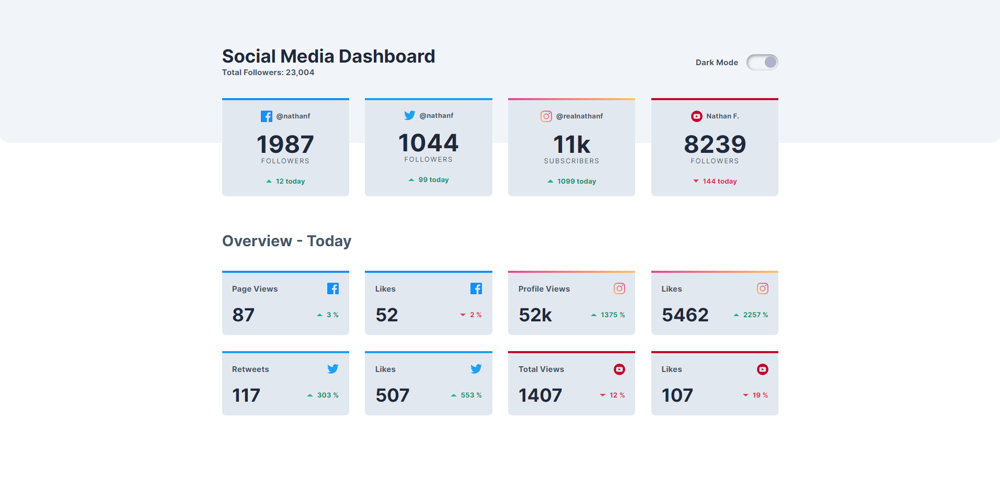
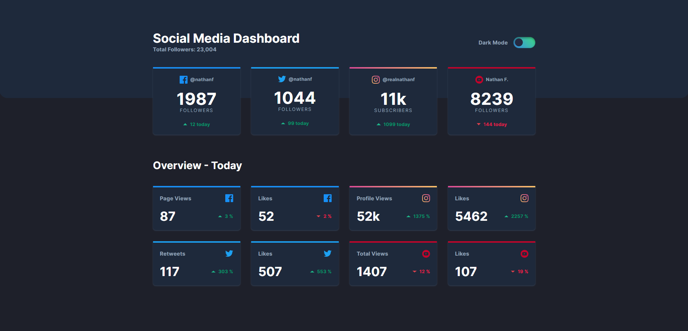

# Frontend Mentor - Social media dashboard with theme switcher solution

This is a solution to the [Social media dashboard with theme switcher challenge on Frontend Mentor](https://www.frontendmentor.io/challenges/social-media-dashboard-with-theme-switcher-6oY8ozp_H). Frontend Mentor challenges help you improve your coding skills by building realistic projects. 

## Table of contents

- [Overview](#overview)
  - [The challenge](#the-challenge)
  - [Screenshot](#screenshot)
  - [Links](#links)
- [My process](#my-process)
  - [Built with](#built-with)
  - [What I learned](#what-i-learned)
- [Author](#author)

## Overview

### The challenge

Users should be able to:

- View the optimal layout for the site depending on their device's screen size
- See hover states for all interactive elements on the page
- Toggle color theme to their preference

### Screenshot

- Main_day-mode: 
- Main_night-mode: 

### Links

- Solution URL: [https://github.com/Jo-cloud85/social-media-dashboard.git](https://github.com/Jo-cloud85/social-media-dashboard.git)
- Live Site URL: [https://jo-cloud85.github.io/social-media-dashboard/](https://jo-cloud85.github.io/social-media-dashboard/)

## My process

### Built with

- Semantic HTML5 markup
- CSS custom properties
- Flexbox
- CSS Grid
- Mobile-first workflow
- [React](https://reactjs.org/) - JS library
- [Tailwind CSS](https://tailwindcss.com/docs/installation/using-postcss) - CSS framework

### What I learned

- Tailwind CSS
  - Having known and used Bootstrap, Tailwind CSS turns out to be relatively simple to learn and use. 

- useEffect
  - As someone just beginning to learn React, this is my first time using useEffect hook. The application comes about when I had 
  issues toggling and syncing the mode of the interface and toggle switch. I used the useEffect hook to ensure that the CSS class
  is applied correctly, to add or remove the class whenever the darkMode state changes. 

- Refactoring using map, template literals and json file
  - To minimize repetition in code while generating the respective cards for each social media, one of the most useful methods is
  to consolidate the data into a json file and use the map function to iterate through each social media data and generate the 
  HTML elements dynamically.

## Author

- Frontend Mentor - [@Jo-cloud85](https://www.frontendmentor.io/profile/Jo-cloud85)

